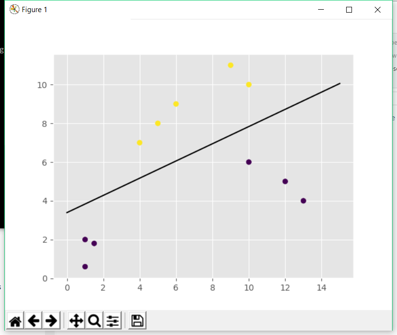

# SVM-linear demo

## Vereisten
Het prototype is gebouwd en getest op 64-bits Windows- en 64-bits Linux-systemen om de werking van de code te verifiëren.

Voor deze demo dienen een aantal zaken geïnstalleerd te zijn op de omgeving waarin deze demo wordt uitgevoerd.

- Python versie 3.6   (https://www.python.org/downloads/release/python-364/)
- Pip versie 10.0     (https://pip.pypa.io/en/stable/installing/)

## Installatie
Om de programmacode te draaien heb je de volgende Python-modulen nodig:

- numpy (voor het aanleveren van een functie om een array te maken);
- matplotlib (voor het creëeren van de plots).
- sklearn (voor het aanleveren van de dataset voor de demo en functies om machine learning mogelijk te maken)<br><br>

Voer de volgende commando's uit om alles te installeren: <br>
```
- pip install numpy
- pip install matplotlib
- pip install sklearn
```

Voer het volgende commando uit in een console in de source-map van je project:
```
python demo.py
```

## Data
De data is een zelfverzonnen array met coördinaten erin. De array is te vinden in de code

## Code
```python
import numpy as np
import matplotlib.pyplot as plt
from matplotlib import style
style.use("ggplot")
from sklearn import svm

# Coördinaten van de punten
X = np.array([[1,2],
             [5,8],
             [1.5,1.8],
             [6,9],
             [1,0.6],
             [9,11],
             [4,7],
             [12,5],
             [10,6],
             [13,4],
             [10,10]])

# Labels die bij de punten horen, op volgorde
# y = [0,1,0,1,0,2,1,3,3,3,2]

# De coördinaten alleen maar gelabeld op 0 en 1
y = [0,1,0,1,0,1,1,0,0,0,1]

# Aangeven dat het lineair is(de classifier)
clf = svm.SVC(kernel='linear', C = 1.0)

# Features aan de labels koppelen
clf.fit(X,y)

# X-coördinaat aan de gebruiker vragen
xC = input("Welke x-coördinaat wil je voorspellen?")
print("X-coördinaat: ", xC)

# Y-coördinaat aan de gebruiker vragen
yC = input("Welke y-coördinaat wil je voorspellen?")
print("X-coördinaat: ", yC)

# De voorspelling maken van de opgegeven coördinaten en deze printen
voorspelling = clf.predict([float(xC),float(yC)])
print("Voorspelling voor coördinaten: (",([float(xC),float(yC)]),"), de voorspelling valt binnen categorie ", voorspelling)

w = clf.coef_[0]

a = -w[0] / w[1]

xx = np.linspace(0,15)
yy = a * xx - clf.intercept_[0] / w[1]

# De schijdingslijn, kan uitgezet worden door deze in comments te plaatsen
h0 = plt.plot(xx, yy, 'k-', label="Schijdingslijn")

# Het tekeken van de grafiek, kan ook uitgezet worden
plt.scatter(X[:, 0], X[:, 1], c = y)
plt.show()

```

## Uitleg demo
Het idee van deze demo is om van een coördinaat te voorspellen in welk cluster deze valt. Hiervoor worden eerst coördinaten aan labels gekoppeld. 
De volgende coördinaten 
```python
X = np.array([[1,2],
             [5,8],
             [1.5,1.8],
             [6,9],
             [1,0.6],
             [9,11],
             [4,7],
             [12,5],
             [10,6],
             [13,4],
             [10,10]])
```
worden gekoppeld aan de labels
```python
y = [0,1,0,1,0,1,1,0,0,0,1]
```
Hierbij wordt in dit geval slechts onderscheid gemaakt tussen twee labels, namelijk '0' en '1'. Dit is het meest toepasbare om uiteindelijk een lijn te kunnen plotten die de twee groepen coördinaten van elkaar onderscheidt. Het is ook mogelijk om meerdere clusters te maken, zoals
```python
y = [0,1,0,1,0,2,1,3,3,3,2]
```
Op deze manier kan je meerdere groepen onderscheiden, maar de lijn zal alleen getekend worden tussen de labels '0' en '1'. 

Het laatste stuk van de code
```python
w = clf.coef_[0]

a = -w[0] / w[1]

xx = np.linspace(0,15)
yy = a * xx - clf.intercept_[0] / w[1]

# De schijdingslijn, kan uitgezet worden door deze in comments te plaatsen
h0 = plt.plot(xx, yy, 'k-', label="Schijdingslijn")

# Het tekeken van de grafiek, kan ook uitgezet worden
plt.scatter(X[:, 0], X[:, 1], c = y)
plt.show()
```
is alleen nodig om de grafiek te plotten. Zonder deze grafiek werkt de code prima, alleen zie je niks visueels. Als je alleen de code wil zonder de grafiek kan je dat stuk code in commentaar zetten. 

## Resultaat applicatie
Als de applicatie gedraaid wordt, wordt er in de console gevraagd naar de resultaten die je wil voorspellen. De uitkomst hiervan,als de grafiek niet als comment gezet is, zal er ongeveer zo uitzien. 


## Bruikbaarheid SVM-linear
SVM-linear is voor onze casus niet bruikbaar. Dit komt omdat deze methode alleen maar werkt met coördinaten op een x- en y-as, dit komt niet overeen met onze data, namelijk een set features met een label eraan gekoppeld. 

